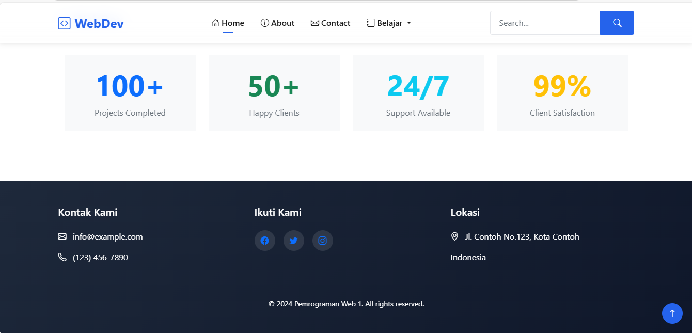

# UTS_PemrogramanWeb1

## PROFIL

| Variable           | Isi                       |
| ------------------ | ------------------------- |
| **Nama**           | Ahmad Ridho Septian       |
| **NIM**            | 312310447                 |
| **Kelas**          | TI.23.A.5                 |
| **Mata Kuliah**    | Pemrograman Web 1         |
| **Dosen Pengampu** | Eko Budiarto S.kom, M.kom |

# Selamat datang di proyek web **Website Dinamis**!

## Halaman Home

Halaman Home adalah bagian awal dari website yang menyambut pengunjung dengan informasi tentang fitur-fitur yang ditawarkan. Berikut adalah komponen utama yang terdapat di halaman ini:

1. Bagian Selamat Datang
   Menampilkan judul besar "Selamat Datang di Website Kami" dan deskripsi singkat yang menjelaskan tujuan website.
2. Fitur-Fitur
   Terdapat tiga fitur utama yang ditampilkan dalam format grid responsif:
   Responsive Design: Menyediakan tampilan website yang optimal di berbagai perangkat.
   Modern Technology: Menggunakan teknologi terkini untuk meningkatkan pengalaman pengguna.
   Analytics Integration: Menawarkan integrasi analisis data untuk memantau performa website.
3. Statistik
   Menampilkan statistik yang menarik dalam format kartu, termasuk:
   100+ Projects Completed
   50+ Happy Clients
   24/7 Support Available
   99% Client Satisfaction
4. Efek Animasi
   Menggunakan efek animasi AOS (Animate On Scroll) untuk menambah daya tarik visual saat pengguna menggulir halaman.

## Halaman About

Halaman About memberikan informasi mengenai tim dan misi website. Berikut adalah komponen utama yang terdapat di halaman ini:

1. Tentang Kami
   Menampilkan judul "Tentang Kami" dengan deskripsi yang menjelaskan komitmen tim dalam memberikan solusi digital terbaik.
   Memuat informasi tentang pengalaman tim dalam industri pengembangan web selama lebih dari 5 tahun.
2. Tombol Aksi
   Terdapat dua tombol untuk menghubungi tim atau melihat lebih lanjut tentang anggota tim:
   Hubungi Kami: Mengarahkan pengguna ke halaman kontak.
   Tim Kami: Mengarahkan pengguna ke bagian yang menampilkan anggota tim.
3. Tim Kami
   Menampilkan daftar anggota tim dalam format grid dengan efek animasi:
   Setiap anggota tim memiliki gambar, nama, jabatan, dan tautan ke profil sosial (LinkedIn, Twitter, GitHub).
   Anggota tim yang ditampilkan termasuk CEO, Lead Developer, UI/UX Designer, dan Marketing Lead.
4. Efek Animasi
   Menggunakan efek animasi AOS (Animate On Scroll) untuk meningkatkan tampilan saat pengguna menggulir halaman.

## Halaman Contact

Halaman Kontak menyediakan informasi penting bagi pengguna untuk menghubungi tim. Berikut adalah komponen utama yang terdapat di halaman ini:

1. Informasi Kontak
   Alamat: Menampilkan alamat lengkap kantor atau lokasi.
   Contoh: Jl. Contoh No.123, Kota Contoh, Indonesia 12345.
   Email: Menyediakan dua alamat email untuk informasi umum dan dukungan.
   Contoh: info@example.com, support@example.com.
   Telepon: Menyediakan dua nomor telepon yang dapat dihubungi.
   Contoh: (123) 456-7890, (098) 765-4321.
   Jam Operasional: Menyediakan jam kerja tim.
   Contoh:
   Senin - Jumat: 09:00 - 17:00
   Sabtu: 09:00 - 14:00
2. Desain Visual
   Setiap informasi dilengkapi dengan ikon yang relevan untuk menambah daya tarik visual.
   Ikon menggunakan Bootstrap Icons dan memiliki latar belakang berwarna sesuai kategori (alamat, email, telepon, dan jam operasional).
   Desain menggunakan kelas Bootstrap seperti bg-light, rounded-3, dan shadow-sm untuk tampilan yang bersih dan modern.
3. Efek Animasi
   Menggunakan efek animasi AOS (Animate On Scroll) untuk memberikan pengalaman pengguna yang lebih dinamis saat menggulir halaman.

## Halaman DataTables

Halaman DataTables menyajikan data dalam format tabel yang interaktif dan responsif, memungkinkan pengguna untuk dengan mudah melihat, mengurutkan, dan mencari informasi. Berikut adalah komponen utama yang terdapat di halaman ini:

1. Judul Halaman
   Judul: Menampilkan teks "DataTables" untuk menjelaskan tujuan halaman ini.
2. Tabel Contoh
   Tabel: Menggunakan elemen <table> untuk menampilkan data. Tabel ini memiliki kelas table dan table-striped dari Bootstrap untuk memberi gaya yang bersih dan teratur.
   Struktur Tabel:
   Header Tabel (<thead>): Mencakup judul kolom seperti:
   Name: Nama individu.
   Position: Jabatan individu di perusahaan.
   Office: Lokasi kantor.
   Age: Usia individu.
   Start date: Tanggal mulai bekerja.
   Salary: Gaji individu.
   Isi Tabel (<tbody>): Berisi beberapa baris contoh data yang mencakup nama, posisi, kantor, usia, tanggal mulai, dan gaji. Berikut adalah beberapa contoh entri:
   Ahmad Ridho Septian, System Architect, Tokyo, 20, 2003/04/25, $999,999
   Ethan Winters, Accountant, Tokyo, 63, 2011/07/25, $300,750
   Tiger Nixon, System Architect, Edinburgh, 61, 2011-04-25, $320,800
3. Interaktivitas
   Tabel ini dapat diperluas dengan fitur-fitur seperti pencarian, pengurutan, dan paginasi jika Anda mengintegrasikan DataTables jQuery plugin. Ini memungkinkan pengguna untuk dengan mudah mencari dan mengurutkan data sesuai kebutuhan.
4. Desain Visual
   Menggunakan kelas Bootstrap untuk memastikan bahwa tabel memiliki tampilan yang responsif dan dapat diakses dengan baik di berbagai perangkat.
   Tabel juga memiliki gaya striping yang membuatnya lebih mudah dibaca.
5. Catatan Implementasi
   Pastikan untuk menyertakan pustaka DataTables dalam proyek Anda untuk mengaktifkan fitur interaktif.
   Anda juga dapat menyesuaikan tabel dengan menambahkan kolom atau menyesuaikan data sesuai dengan kebutuhan aplikasi Anda.

## Halaman Form

Halaman ini menyajikan formulir yang menarik untuk pengguna, memungkinkan mereka untuk memasukkan informasi dengan mudah. Berikut adalah komponen utama yang terdapat di halaman ini:

1. Formulir Input
   Judul Formulir: "Halaman Form" ditampilkan di bagian atas formulir dengan kelas text-center.
   Elemen Formulir:
   Email Address:

Menggunakan grup input dengan ikon @ untuk menunjukkan bahwa input adalah email.
Teks bantuan untuk memberi tahu pengguna bahwa email mereka tidak akan dibagikan.
Password:

Input untuk kata sandi dengan placeholder "**\*\*\*\***".
Checkbox:

Menggunakan checkbox untuk memberikan opsi kepada pengguna dengan label "Check me out".
Tombol Kirim:

Tombol Submit yang berwarna biru dan lebar penuh untuk mengirimkan formulir.

2. Bootstrap JS
   Menggunakan skrip Bootstrap yang diambil dari CDN untuk menambahkan fungsionalitas interaktif.
3. Catatan Implementasi
   Formulir ini dapat diperluas dengan menambahkan validasi input atau menghubungkan ke backend untuk mengelola data yang dimasukkan.
   Anda dapat menyesuaikan label, placeholder, dan opsi checkbox sesuai kebutuhan aplikasi Anda.

## Halaman 404

Halaman ini menampilkan pesan kesalahan 404 yang memberitahukan pengguna bahwa halaman yang mereka cari tidak dapat ditemukan. Berikut adalah komponen utama yang terdapat di halaman ini:

1. Pesan Kesalahan
   Judul: "404 Not Found" ditampilkan sebagai judul utama menggunakan elemen h1 yang memberi tahu pengguna tentang kesalahan.
   Pesan Error: Teks tambahan yang menjelaskan bahwa halaman yang dicari tidak ada, menggunakan elemen p dengan kelas error-message.
2. Tautan Kembali ke Beranda
   Tautan: Menggunakan elemen a untuk memberikan tombol "Go Back Home". Tautan ini mengarah kembali ke halaman beranda ("/"), memudahkan pengguna untuk kembali ke bagian yang berfungsi dari situs.
   Kelas: Tautan menggunakan kelas home-button untuk menerapkan gaya khusus, yang bisa Anda sesuaikan di CSS.
